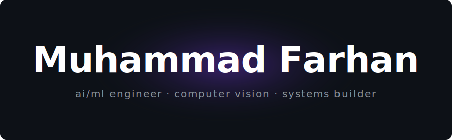

<!-- ████████████████████████████████████████████████ -->
<!--              MUHAMMAD FARHAN — GITHUB PROFILE              -->
<!-- ████████████████████████████████████████████████ -->

<div align="center">

</div>

<br/>

<!-- ── TERMINAL TYPING ANIMATION ── -->
<div align="center">


</div>

<br/>

<!-- ── STATS BADGES ROW 1 ── -->
<div align="center">


&nbsp;

&nbsp;

&nbsp;

&nbsp;


</div>

<!-- ── STATS BADGES ROW 2 ── -->
<div align="center">


&nbsp;

&nbsp;


</div>

<br/>

---

<!-- ── GITHUB TROPHIES ── -->
<div align="center">

[](https://github.com/muhmdfarhan0)

</div>

---

<!-- ── JUPYTER WHOAMI ── -->

**`In [1]:`** &nbsp; `whoami`

```python
me = {
    "name":          "Muhammad Farhan",
    "role":          "AI/ML Engineer & Computer Vision Specialist",
    "agency":        "Datraxa.com — founder & builder",
    "location":      "Islamabad, Pakistan 🇵🇰",
    "education":     "BS Data Science — Air University (CGPA 3.28/4.0)",
    "experience":    "4+ years in CV, ML, Edge AI, Automation",
    "products":      ["PromptPix (promptpix.site)",
                      "Scrapreach (scrapreach.online)"],
    "fiverr":        "Level 2 Seller · 120+ projects · 4.9 ⭐",
    "open_to":       "Remote ML/CV/AI roles (US & UK startups)",
    "currently":     "Building AI tools @ Datraxa · job hunting",
}
```

**`Out [1]:`**

```
{'name': 'Muhammad Farhan', 'role': 'AI/ML Engineer & Computer Vision Specialist', ...}
```

<br/>

---

<!-- ── WHAT I'VE BUILT ── -->
## 🚀 Live Products

<table>
<tr>
<td width="50%" valign="top">

### [PromptPix](https://promptpix.site)
AI-powered visual search engine. Search and discover images using natural language prompts — built on CLIP-based embeddings and vector search.

[](https://promptpix.site)


</td>
<td width="50%" valign="top">

### [Scrapreach](https://scrapreach.online)
B2B lead generation platform. Automated data collection, enrichment, and outreach pipeline at scale — targeting US & UK markets.

[](https://scrapreach.online)


</td>
</tr>
</table>

---

<!-- ── TECH STACK ── -->
## 🛠️ Tech Stack

**AI / ML / Computer Vision**


**Backend & APIs**


**Scraping & Automation**


**Data & Infrastructure**


**Annotation Tools**


---

<!-- ── ANIMATED SKILL BARS ── -->
## 📈 Skill Activity

<div align="center">


</div>

---

<!-- ── GITHUB STATS ── -->
## 📊 GitHub Stats

<div align="center">


&nbsp;


</div>

<div align="center">


</div>

---

<!-- ── CONTRIBUTION SNAKE ── -->
## 🐍 Contribution Snake

<div align="center">

<picture>
  <source media="(prefers-color-scheme: dark)" srcset="https://raw.githubusercontent.com/muhmdfarhan0/muhmdfarhan0/output/github-contribution-grid-snake-dark.svg"/>
  <source media="(prefers-color-scheme: light)" srcset="https://raw.githubusercontent.com/muhmdfarhan0/muhmdfarhan0/output/github-contribution-grid-snake.svg"/>
  
</picture>

</div>

---

<!-- ── ACTIVITY GRAPH ── -->
<div align="center">


</div>

---

<!-- ── OPEN TO WORK ── -->
## 💼 Open to Opportunities

> **Actively looking for remote ML / CV / AI Engineering roles at US & UK funded startups**
>
> Available as **contractor or full-time remote** from Islamabad, Pakistan.
>
> Ideal roles: **Computer Vision Engineer** · **ML Engineer** · **AI Engineer** · **Automation Engineer**

<br/>


---

<!-- ── CONNECT ── -->
## 🤝 Let's Connect

<div align="center">

[](https://www.linkedin.com/in/muhammad-farhan07567)
&nbsp;
[](mailto:muhammadfarhan03333@gmail.com)
&nbsp;
[](https://datraxa.com)
&nbsp;
[](https://promptpix.site)
&nbsp;
[](https://scrapreach.online)

</div>

<br/>

<div align="center">

*"Building intelligent systems that see, understand, and act in the real world."*

<br/>


</div>

<!--
══════════════════════════════════════════════════
SETUP: SNAKE ANIMATION
══════════════════════════════════════════════════
Create .github/workflows/snake.yml with this content:

name: Generate Snake Animation
on:
  schedule: [{ cron: "0 */12 * * *" }]
  workflow_dispatch:
jobs:
  generate:
    runs-on: ubuntu-latest
    steps:
      - uses: Platane/snk@v3
        with:
          github_user_name: ${{ github.repository_owner }}
          outputs: |
            dist/github-contribution-grid-snake.svg
            dist/github-contribution-grid-snake-dark.svg?palette=github-dark
      - uses: crazy-max/ghaction-github-pages@v3
        with:
          target_branch: output
          build_dir: dist
        env:
          GITHUB_TOKEN: ${{ secrets.GITHUB_TOKEN }}

Then: Settings → Actions → General → "Read and write permissions" → Save
Then: Actions tab → "Generate Snake Animation" → Run workflow
══════════════════════════════════════════════════
-->
