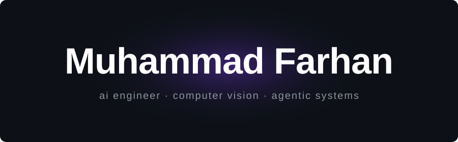

<!-- ████████████████████████████████████████████████ -->
<!--              MUHAMMAD FARHAN — GITHUB PROFILE              -->
<!-- ████████████████████████████████████████████████ -->

<div align="center">

</div>

<br/>

<!-- ── TERMINAL TYPING ANIMATION ── -->
<div align="center">


</div>

<br/>

<!-- ── STATS BADGES ROW 1 ── -->
<div align="center">


&nbsp;

&nbsp;

&nbsp;

&nbsp;


</div>

<!-- ── STATS BADGES ROW 2 ── -->
<div align="center">


&nbsp;

&nbsp;


</div>

<br/>

---

<!-- ── JUPYTER WHOAMI ── -->

**`In [1]:`** &nbsp; `whoami`

```python
me = {
    "name":          "Muhammad Farhan",
    "portfolio":     "https://www.farhanai.online",
    "role":          "AI Engineer — Agentic Systems, Computer Vision & Edge ML",
    "education":     "BS Data Science — Air University (CGPA 3.28/4.0)",
    "experience":    "4+ years shipping production AI/ML systems",
    "work_history":  ["Founder & AI Engineer @ Datraxa (2023 — Present)",
                      "LLM Evaluator @ Turing.com (2024)",
                      "AI Engineer @ CaptainAI, Netherlands (2024)",
                      "Freelance AI/ML Engineer @ Fiverr — Level 2, 120+ projects"],
    "products":      ["arxiv2code (arxiv2code.vercel.app)",
                      "LingoScribe (lingoscribe-frontend.vercel.app)",
                      "PromptPix (promptpix.site)",
                      "Scrapreach (scrapreach.online)"],
    "core_skills":   ["Agentic AI (LangChain, Claude/GPT tool-use, MCP)",
                      "Computer Vision (YOLOv8, PyTorch, OpenCV)",
                      "Edge ML (RKNN, ONNX, INT8 quantization)",
                      "Scraping & Automation at scale (Playwright, Apify)"],
    "location":      "Islamabad, Pakistan 🇵🇰",
    "open_to":       "Remote AI Engineer roles — full-time or contract",
}
```

**`Out [1]:`**

```
{'name': 'Muhammad Farhan', 'role': 'AI Engineer — Agentic Systems, Computer Vision & Edge ML', ...}
```

<br/>

---

<!-- ── WHAT I'VE BUILT ── -->
## 🚀 Live Products

<table>
<tr>
<td width="50%" valign="top">

### [arxiv2code](https://arxiv2code.vercel.app)
Paste any arXiv paper, get a real implementation kit — engineering blueprint, extracted hyperparameter config, starter PyTorch code, and a reproducibility checklist. Multi-provider LLM fallback chain (Groq → NVIDIA → Gemini), load-tested, with its own eval harness.

[](https://arxiv2code.vercel.app)


</td>
<td width="50%" valign="top">

### [LingoScribe](https://lingoscribe-frontend.vercel.app)
AI speech-to-text for Urdu & Punjabi. Transcribe audio, get segment-level English translation, AI insights, and live mic recording — no signup required.

[](https://lingoscribe-frontend.vercel.app)


</td>
</tr>
<tr>
<td width="50%" valign="top">

### [PromptPix](https://promptpix.site)
AI-powered visual search engine. Search and discover images using natural language prompts — built on CLIP-based embeddings and vector search.

[](https://promptpix.site)


</td>
<td width="50%" valign="top">

### [Scrapreach](https://scrapreach.online)
B2B lead generation platform. Automated data collection, enrichment, and outreach pipeline at scale — targeting US & UK markets.

[](https://scrapreach.online)


</td>
</tr>
</table>

---

<!-- ── AI TOOLS & EXPERIMENTS ── -->
## 🧰 AI Tools & Experiments

Smaller, focused tools — mostly free, no-signup, built to solve one problem well.

| Tool | What it does | Stack |
|---|---|---|
| [**SmartJSON**](https://muhmdfarhan0.github.io/smartjson/) | AI-powered JSON formatter, validator & error explainer — broken JSON gets fixed in plain English | Groq · JS |
| [**QueryCraft**](https://github.com/muhmdfarhan0/querycraft) | Natural language → SQL generator, powered by Llama 3.3 70B on Groq | Groq · JS |
| [**CronSpeak**](https://github.com/muhmdfarhan0/cronspeak) | Natural language → cron expression converter | Groq · JS |
| [**JobTrackr**](https://muhmdfarhan0.github.io/jobtrackr/) | Kanban-board job application tracker — no sign-up, no backend, fully offline | TypeScript |
| [**Disaster Recovery Advisor**](https://github.com/muhmdfarhan0/disaster-recovery-compliance-advisor) | RAG chatbot for disaster recovery, compliance & cybersecurity guidance | Flask · Groq · Vector Search |

---

<!-- ── TECH STACK ── -->
## 🛠️ Tech Stack

**AI / ML / Computer Vision**


**LLMs & RAG**


**Backend & APIs**


**Scraping & Automation**


**Data & Infrastructure**


**Annotation Tools**


---

<!-- ── ANIMATED SKILL BARS ── -->
## 📈 Skill Activity

<div align="center">


</div>

---

<!-- ── GITHUB STATS ── -->
## 📊 GitHub Stats

<div align="center">


</div>

---

<!-- ── CONTRIBUTION SNAKE ── -->
## 🐍 Contribution Snake

<div align="center">

<picture>
  <source media="(prefers-color-scheme: dark)" srcset="https://raw.githubusercontent.com/muhmdfarhan0/muhmdfarhan0/output/github-contribution-grid-snake-dark.svg"/>
  <source media="(prefers-color-scheme: light)" srcset="https://raw.githubusercontent.com/muhmdfarhan0/muhmdfarhan0/output/github-contribution-grid-snake.svg"/>
  
</picture>

</div>

---

<!-- ── ACTIVITY GRAPH ── -->
<div align="center">


</div>

---

<!-- ── OPEN TO WORK ── -->
## 💼 Open to Opportunities

> **Data Science graduate with 4+ years of real-world AI engineering experience — actively looking for remote AI Engineer roles.**
>
> Available as **full-time or contract remote** from Islamabad, Pakistan.
>
> Ideal roles: **AI Engineer** · **ML Engineer** · **Computer Vision Engineer** · **Applied AI / Agentic AI Engineer**

<br/>


---

<!-- ── CONNECT ── -->
## 🤝 Let's Connect

<div align="center">

[](https://www.farhanai.online)
&nbsp;
[](https://www.linkedin.com/in/muhammad-farhan07567)
&nbsp;
[](mailto:muhammadfarhan03333@gmail.com)
&nbsp;
[](https://datraxa.com)

</div>

<div align="center">

[](https://arxiv2code.vercel.app)
&nbsp;
[](https://lingoscribe-frontend.vercel.app)
&nbsp;
[](https://promptpix.site)
&nbsp;
[](https://scrapreach.online)

</div>

<br/>

<div align="center">

*"Building intelligent systems that see, understand, and act in the real world."*

<br/>


</div>

<!--
══════════════════════════════════════════════════
SETUP: SNAKE ANIMATION
══════════════════════════════════════════════════
Create .github/workflows/snake.yml with this content:

name: Generate Snake Animation
on:
  schedule: [{ cron: "0 */12 * * *" }]
  workflow_dispatch:
jobs:
  generate:
    runs-on: ubuntu-latest
    steps:
      - uses: Platane/snk@v3
        with:
          github_user_name: ${{ github.repository_owner }}
          outputs: |
            dist/github-contribution-grid-snake.svg
            dist/github-contribution-grid-snake-dark.svg?palette=github-dark
      - uses: crazy-max/ghaction-github-pages@v3
        with:
          target_branch: output
          build_dir: dist
        env:
          GITHUB_TOKEN: ${{ secrets.GITHUB_TOKEN }}

Then: Settings → Actions → General → "Read and write permissions" → Save
Then: Actions tab → "Generate Snake Animation" → Run workflow
══════════════════════════════════════════════════
-->
